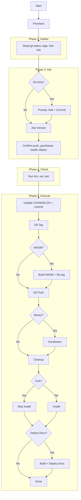

# Release Workflow

task-plus automates the release process for Go projects. The workflow runs through five phases: Precheck, Gather, Ask, Check, and Execute.

## Flowchart

## Phases

### 1. Precheck
Runs any configured precheck commands (e.g. `task precheck`). Fails fast before user interaction.

### 2. Gather
Read-only state probing:
- Git status (dirty/clean)
- Existing tags and retracted versions
- Suggested next version (auto-incremented, skipping retracted)
- Fork detection (go.mod vs git remote)
- Goreleaser config detection
- Forge detection (GitHub/Gitea) and release cleanup candidates

### 3. Ask
Interactive prompts:
- Git add/commit if dirty
- Version confirmation (suggested or custom)
- Release comment
- Push, goreleaser, cleanup, install, deploy confirmations

### 4. Check
Runs configured check commands (default: `task check` which runs fmt, vet, test).

### 5. Execute
All mutations in order:
1. Git add + commit (if dirty)
2. Tag existence check
3. Version update task (if configured)
4. CHANGELOG update + auto-commit
5. Git tag
6. WASM build + re-tag (if configured)
7. Git push
8. Goreleaser (binary projects)
9. Release cleanup (old releases)
10. Local install (`go install`)
11. Documentation deployment (configured targets: GitHub Pages, statichost.eu, etc.)
